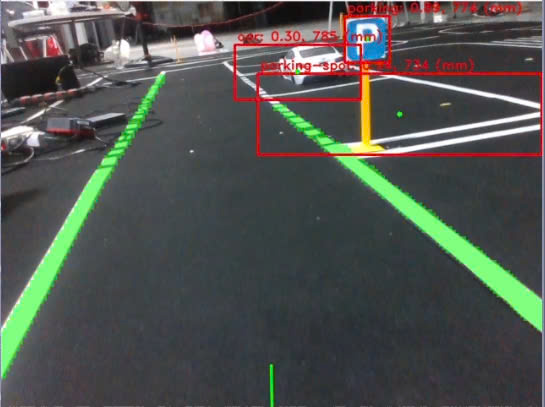
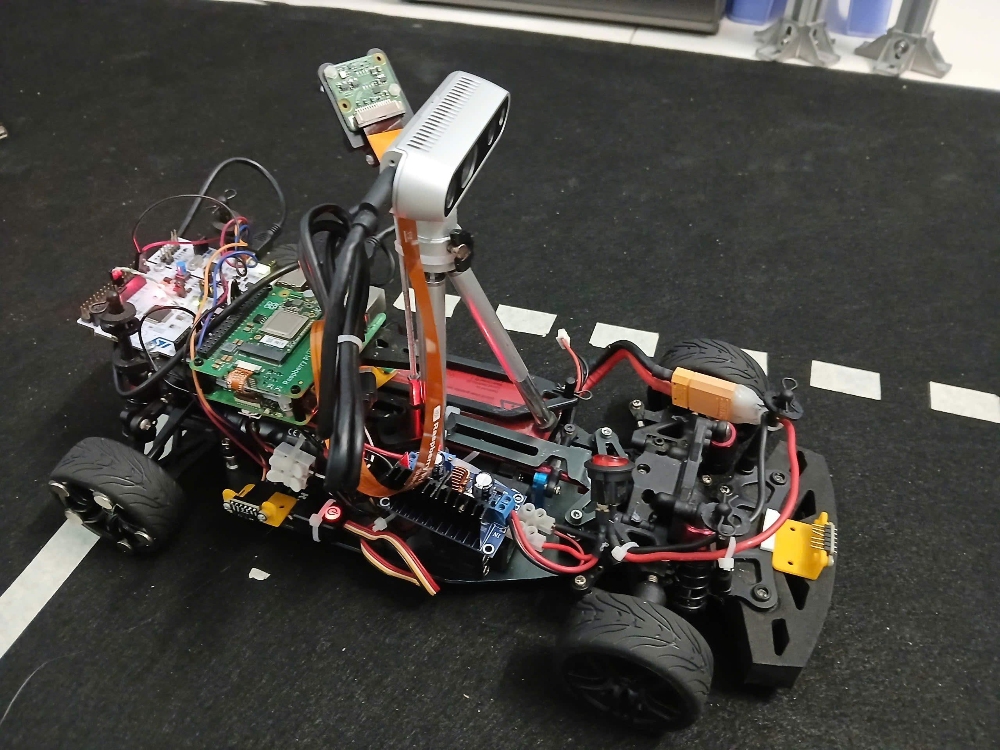
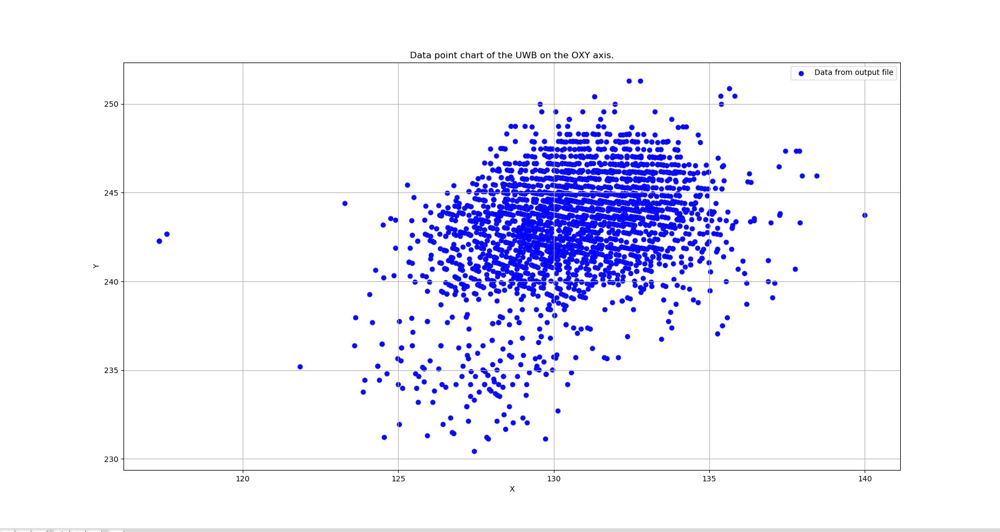
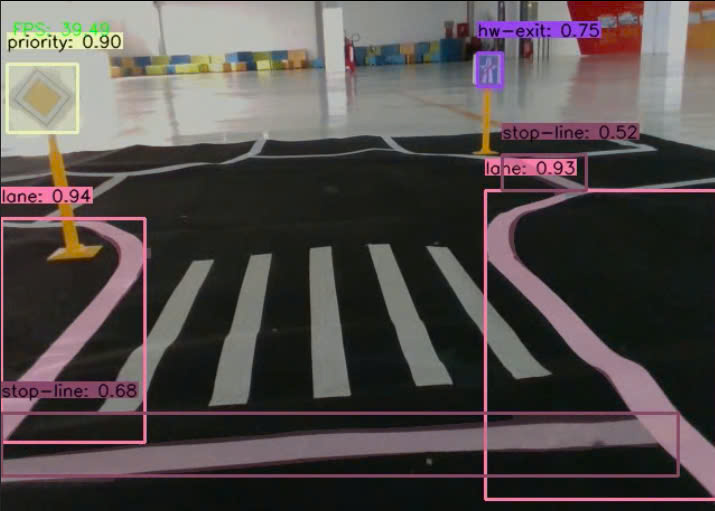
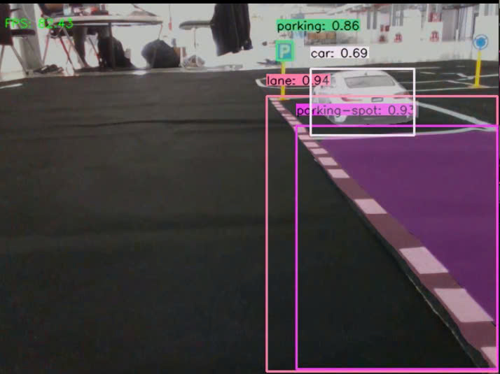

# Information
Team: DriveBeyond  
Date: 17/02/2024  
Description: This is a report article on the status of project 3.

# 📋 Table of Contents

* [Task 1 Depth perception with RealSense and model inference on Hailo for decision making](#task-1-depth-perception-with-realsense-and-model-inference-on-hailo-for-decision-making)  
* [Task 2 Car modification](#task-2-car-modification)  
* [Task 3 Implement UWB-based localisation system](#task-3-implement-uwb-based-localisation-system)  
* [Task 4 Advanced Object Detection and Segmentation System](#task-4-advanced-object-detection-and-segmentation-system)

# Task 1 Integrate deep learning models
## 📂 Project Directory Structure
```bash
~/project-status-3/src/Task_1
├── autopilot.py
├── yolov8n_seg.hef
└── decision_making/
   ├── threadRealsenseCamera.py
   └── threads/
      ├── hailoRunner.py
      ├── processRealsenseCamera.py
      └── postProcessing.py
```

## 📝 Description
   Using a RealSense camera, we extract depth information and employ YOLOv8 for object detection to identify and avoid obstacles while selecting a parking spot. Additionally, we utilize the segmentation variant to detect lane markings, assisting with lane-keeping tasks.

**Realsense Camera depth and color reading**  
   - File: `processRealsenseCamera.py` and `threadRealsenseCamera.py`
   - Functionality: A new package for depth and rgb data reading from Realsense Camera, invokes `hailoRunner.py` for detection of obstacles for avoidance and identifies potential parking spots and uses segmentation to extract lane markings and assist in lane-keeping.

**YOLO Model Binary for Hailo Inference**  
   - File: `yolov8n_seg.hef` 
   - Functionality: A compiled binary file optimized using SDK for execution on the Hailo AI accelerator, enabling efficient inference for object detection and segmentation.

**Initialize Hailo device and preprocess segmentation**
   - File: `hailoRunner.py` and `postProcessing.py`
   - Functionality: 
      - `hailoRunner.py`: Initializes the Hailo device for inference.
      - `postProcessing.py`: Processes outputs from the segmentation model’s 10 detection heads.

**Command sending to Nucleo**
   - File: `autopilot.py`
   - Functionality: This file sends command to Nucleo and execute tasks
   - Changes: Added path planning for parking, exit parking and obstacle avoidance

 

# Task 2 Car modification
## 📂 Project Directory Structure
```bash
~/project-status-3/ 
└── src/Task_2/Embedded_Platform
    ├── include
    │   ├── vl53l1x.hpp
    │   ├── distance.hpp
    └── source/drivers
        ├── vl53l1x.cpp
        ├── distance.cpp
```
## 📝 Description
   - Added three VL53L0X sensors to measure distances at the front and sides of the car. We also developed firmware for these sensor and integrated it into the stm32 nucleo

 


# Task 3 Implement UWB-based localisation system
## 📂 Project Directory Structure
```bash
~/project-status-2/src/Task_3
├── set_up_uwb
└── uwb_schematic
```
## 📝 Description
Designed adapter board for DWM1000 UWB modules. - Set up and calibrated the sensors. - Implemented indoor localization using 3 UWB anchors and 1 tag. Preliminary results are promising, with an accuracy of ±10 cm. Further test may be needed to rule out the noise.

**Anchor Calibration**  
   - File: `anchor_calibration.ino`  
   - Functionality: In the set up UWB folder, we flashed the anchor calibration code to measure the signal propagation time.

**Anchor Setup**  
   - File: `set_up_anchor.ino`  
   - Functionality: Then, we flashed the set up anchor file to the three UWB anchors, each with a different address, forming an OXY coordinate system..

**Tag Setup**
- File: `set_up_tag.ino`
- Functionality: Finally, we flashed the set up tag file to receive signals from the three anchors.




# Task 4 Advanced Object Detection and Segmentation System
## ✨ Features

- High-performance object detection and segmentation
- Customizable confidence thresholds for different object classes
- Visual overlay of bounding boxes and segmentation masks
- Real-time FPS monitoring and display


## 📋 Supported Object Classes

The system is optimized for detecting:
- Traffic elements (crosswalks, lanes, stop signs)
- Road infrastructure (highway entries/exits, roundabouts)
- Vehicles and obstacles
- Parking areas and spots
- Priority and no-entry zones
---

## 📁 Project Structure

```
~/project-status-2/src/Task_5
├── bfmc-yolo-training.ipynb    # Training notebook
├── Inference.py                # Video processor
├── requirements.txt            # Dependencies
├── README.md                   # Documentation
└── models/   
```
## 🎓 Training Pipeline (bfmc-yolo-traning.ipynb)

The training pipeline allows to fine-tune YOLOv8 models on my collected datasets.

### Setup

1. Configure Roboflow:
```python
from roboflow import Roboflow
rf = Roboflow(api_key="7QNckPiMtiG2iEUmcCyr")
```

2. Download dataset:
```python

project = rf.workspace("vo-thanh-nguyen").project("nguyen_dep_trai_all_in_one")
version = project.version(10)
dataset = version.download("yolov8")
```


## 🎮 Inference Pipeline (inference.py)

The inference script processes videos using trained YOLO models for object detection and segmentation.

### Supported Object Classes

- Crosswalk (0.8 confidence threshold)
- Highway entry/exit (0.7)
- Lane markings (0.5)
- Traffic signs (0.7)
- Obstacles (0.7)
- Parking areas (0.7)
- Cars (0.7)


## 💻 Usage

```bash
python Inference.py --model best.pt --input /path/to/input.mp4 --output /path/to/output.mp4 [--speed-factor 2] [--device cuda]
```

### Arguments

| Argument | Description | Required | Default |
|----------|-------------|----------|---------|
| `--model` | Path to the YOLOv8 model (.pt file) | Yes | - |
| `--input` | Path to the input video file | Yes | - |
| `--output` | Path to save the processed video | Yes | - |
| `--speed-factor` | Process every nth frame | No | 1 |
| `--device` | Device to run the model on | No | auto-detect |

## 🔍 How It Works

The `VideoProcessor` class implements a pipeline that:

1. Loads the specified YOLOv8 model
2. Processes video frames sequentially
3. Applies object detection and segmentation
4. Filters results based on confidence thresholds
5. Draws bounding boxes and applies segmentation masks
6. Displays processing statistics
7. Saves the annotated video







